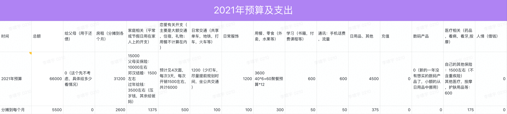
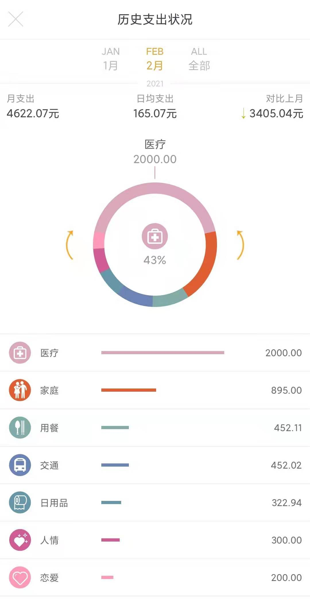

# 2021.02 开支情况

照旧放一下预算便于对比：

---

说明：

- 医疗部分是在理发店除了疣，这部分算是被坑了，导致预算大幅超支
- 家庭部分主要开支是过年给小孩子的压岁钱
- 用餐部分是外卖和过年屯的一些食物
- 交通部分是因为学车产生了很多支出，下个月应该会减少
- 日用品部分还算正常，买了一个电饭锅稍微大笔一些，以后买东西可以多在1688上看看，之前的床上四件套就比双十二还便宜
- 人情部分是捐款，这个属于临时开支，也不可预测
- 恋爱部分是给小萌去看电影

理论上二月的预算是 5500 - 2600 = 2900，实际支出 4622，超支 `1722.07`，一月份预算结余 `72.89`，总超支是 `1649.18`，摊到之后的 10 个月，每月是 165。

所以下个月的支出总预算是：

> 5500 + 2600 - 165 = 7935