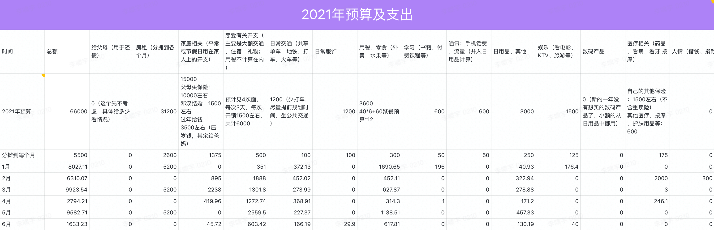

# 2021.06 开支情况

说明：

- 用餐主要是几次同事、同学的聚餐
- 恋爱主要是去青岛的火车票和给小萌买了一点东西
- 交通主要是在青岛的打车，从青岛回来火车站打车等
- 日用品不细说
- 家庭是给琳琳买了个防晒
- 娱乐是豫园门票
- 服饰是防晒衣

6月实际预算是：1966
实际支出：1633.23
太棒了！！！

前5个月总开支：38270.87
前5个月总预算：33000
前5个月总超支：5270.87

为维持预算，后面每个月应该少花：5270.87 / 6 = 878

所以下个月（6月）的实际预算是：

> 5500 + 2600 - 878 = 8978

加油，冲冲冲。