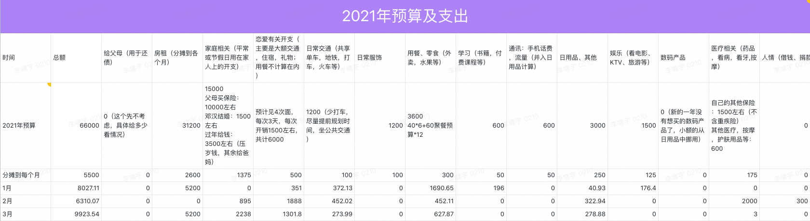

# 2021.02 开支情况

说明：

- 住房部分3，4月固定开支
- 家庭部分是给爸妈买了新手机
- 恋爱部分是给小萌一些生活费和存入见面基金给五一提供预算
- 用餐部分主要是在北京的饮食开支和外卖
- 日用品部分正常开支，买了一个四件套数额稍大
- 交通部分主要是清明回家的火车票

三月理论预算是：8100
实际支出：9923.54
1、2、3月实际总超支：7760.72
为维持预算，之后平均每月应少开支：7760.72 / 9 = 862.3

所以下个月（4月）的实际预算是：

> 5500 - 2600 - 862.3 = 2037.7

(希望下个月不要超预算了)