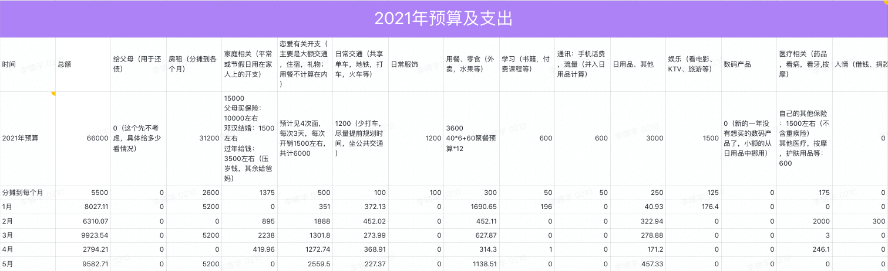

# 2021.03 开支情况

说明：

- 住房部分5,6月固定开支
- 恋爱部分主要是存入见面基金给端午节出去玩的预算，以及一周年纪念的一些支出
- 用餐部分主要是五一一起吃饭以及日常外卖的支出
- 日用品部分稍大额的是话费和爽肤水等
- 交通部分主要是去杭州找勇昊和欢哥的车费开支

这个月用餐部分支出还是挺多的，下个月这部分或许可以少支出一点。

5月理论预算是：8100
实际支出：9582.71
超支：1481.71

前5个月总开支：36637.64
前5个月总预算：30100
前5个月总超支：6537.64

为维持预算，后面每个月应该少花：6537.64 / 7 = 934

所以下个月（6月）的实际预算是：

> 5500 - 2600 - 934 = 1966

感觉想要达成很有难度。
