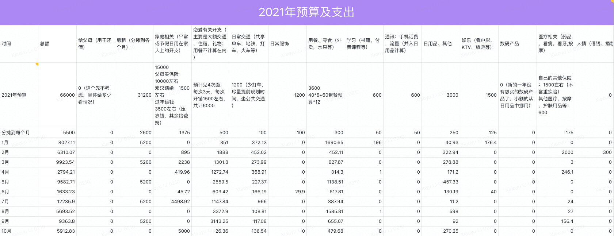

# 2021.10 开支情况

9月份总支出 **5912.83** 元

说明：

- 家庭部分是十一回家给汉的结婚礼金和给奶奶、外婆、妈妈的钱
- 恋爱部分忽略不计
- 用餐部分主要是和同事、朋友出去聚餐花了二百多，其他是外卖或者买菜
- 医疗部分是去看了脚气和痤疮
- 交通部分主要是国庆回上海的火车票和打车的费用
- 日用品部分主要是买了小白锅鼠标垫等东西

截至 10 月，共支出 71476.92 元，整体预算 66000 元。