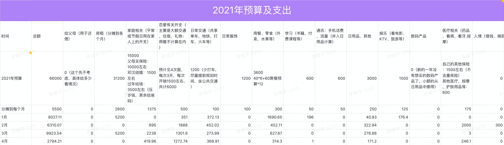

# 2021.04 开支情况

说明：

- 家庭相关支出主要是清明节回家给妈妈妹妹买了衣服；
- 恋爱相关开支主要是出去玩的酒店开销和买了口袋打印机；
- 交通相关支出主要还是打车；
- 医疗相关开支是去医院看了头痒的问题；
- 其他支出不细写了。

**4 月份支出 2794.21，没有超过标准预算。**

前 4 月总开支是：27054.93

前 4 月总预算是：22000

总超支：27054.93 - 22000 = 5054.93

为维持预算，之后平均每月应少开支：5054.93 / 8 = 631.87

所以下个月（5月）的实际预算是：

> 5500 + 2600 - 631.87 = 7468.13