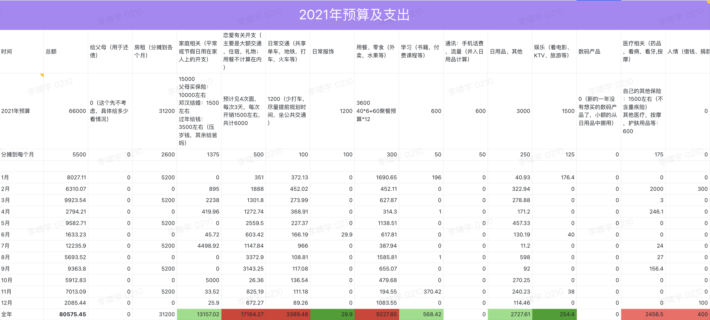

# 2021.12 开支情况

12月份总支出 **2085.44** 元

说明：

- 用餐部分主要是和高磊、大雷、小萌、小姨一起吃饭的支出
- 恋爱部分主要是萌鱼基金和一些小项临时支出
- 日用品主要是话费、小桌子、洗脸巾、团费
- 人情是给建贞一个同学捐了100元
- 交通主要是和高磊、小萌见面时打车的费用
- 家庭主要是给琳琳补习去买资料

## 2021 年预算完成情况

2021 年预算 **66000** 元，实际总支出 **80575.45** 元。超出预算 **14575.45** 元，超支比例 **22.1%**。

其中超支严重的有如下几类：

| 分类 | 预算 | 支出 | 超支 | 超支比例 | 原因 |
| :-- | :-- | :-- | :-- | :-- | :-- |
| 恋爱 | 6000 | 17164.27 | 11164.27 | 186% | 预算定的过于乐观，没有给礼物留出预算； |
| 交通 | 1200 | 3389.48 | 1189.48 | 99% | 没有给回家路费留出预算，日常打车也比较多 |
| 用餐 | 3600 | 9227.85 | 5627.85 | 156% | 大多是和小萌一起吃饭增加的开支 |

