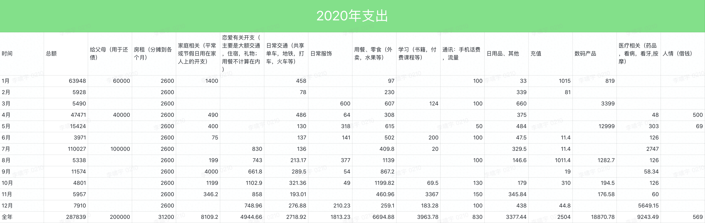
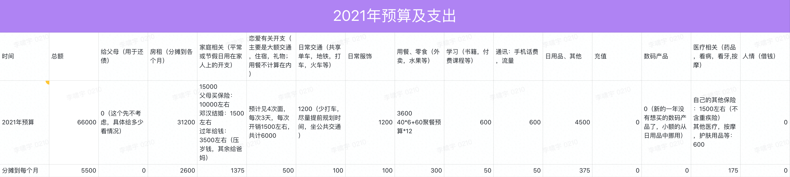
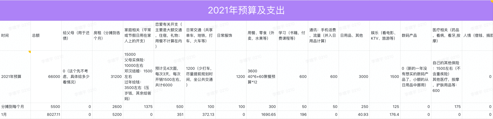

# 2021.01 开支情况

首先先来看看去年一年的总开支情况：

全年总支出快达到 29 万了，其中有 20 万是给爸妈还钱，自己的开支有近 9 万。

梳理了一下各项支出，并制定了 2021 年的年度预算。

新的一年预算 66000，每个月为 5500 元。如果顺利的话，可以节约两万多的支出。

---
一月份的开支情况如下：

说明：

- 住房部分是一二月的房租
- 用餐部分支出较多主要是小萌在这住，中午为了和她一块吃饭，以及周末出去改善伙食而增加的
- 交通部分主要是去太仓练车来回的产生的交通费
- 恋爱部分是替小萌买了回阳原的火车票
- 学习部分是买了一些网课
- 娱乐和日用品部分加在一起没有超过预算

因为房租是两个月一交，一月份会交一二月的房租，所以一月份的预算是：

5500 + 2600 = 8100

实际一月支出：
8027.11

并没有超出预算。