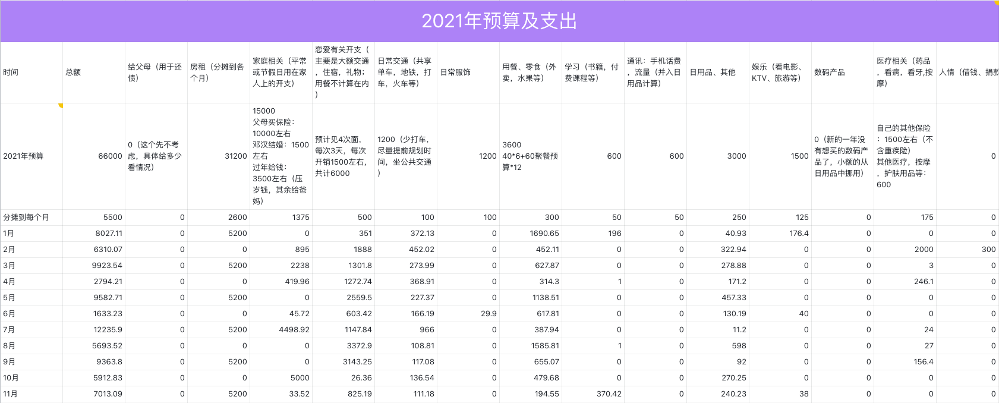

# 2021.11 开支情况

11月份总支出 **7013.09** 元

说明：

- 房租固定开支
- 家庭部分是给琳琳买了个相框
- 恋爱部分是存入萌鱼基金和双十一买的一些东西
- 学习部分是买了个新的域名
- 用餐部分主要是外卖或者买菜
- 医疗部分是去看了一部电影《扬名立万》
- 交通部分主要是一些打车的开支
- 日用品部分主要是买了ipad的保护套和笔

截至 11 月，共支出 78490.01 元，整体预算 66000 元，超支 12490.01 元。