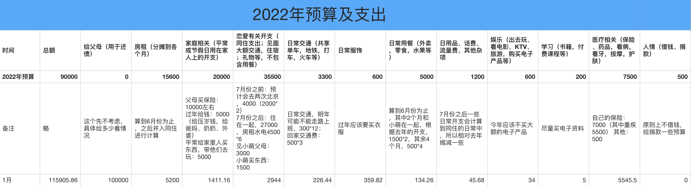

## 2022.01 开支情况

说明：

- 家庭部分主要是给了家里十万用于还银行贷款，另外是过年还琳琳的钱和给琳琳的压岁钱
- 医疗部分主要是交了重疾险的保费
- 住房部分是一二月房租
- 恋爱部分是给小萌的新年红包，恋爱基金，买衣服的钱
- 服饰部分是年前去买了一件羽绒服
- 交通部分主要是过年回不去退票产生的手续费和平常打车的花费
- 用餐部分比较少，因为大部分都是从恋爱基金账户中扣钱的，不计算在内
- 娱乐部分是团建打麻将输的（哭泣）
- 日用品、学习部分开支较少，不细列出

除去给家里用于还贷款的十万，支出了 **15905.86** 元。

预算余额还剩：90000 - 15905.86 = **74094.14**

大部分的支出都是预期内的，比如重疾险的保费、房租。还琳琳之前借的一千块钱和给小萌的压岁钱倒是不在计划之内，不过因为没有回家，所以有些给长辈的钱没给（给了妈妈两千，后面她又通过压岁钱发还给我了，这个就抵消不计算了），所以还是在预算之内。