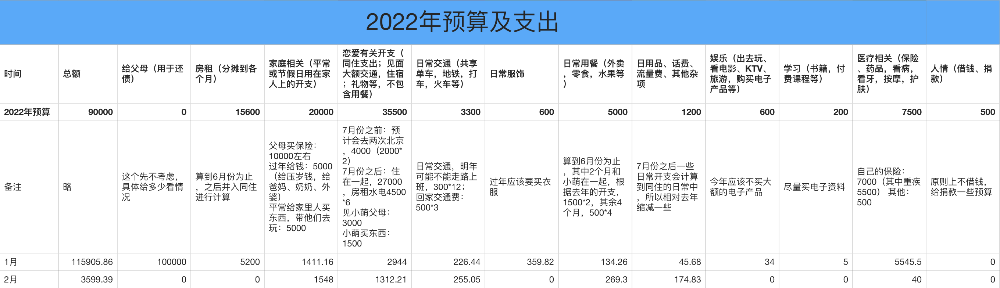

## 2022.02 开支情况

说明：

- 家庭部分主要是给奶奶的钱和给其他几个妹妹的压岁钱
- 恋爱部分是给小萌的情人节红包，恋爱基金，羽毛球拍等
- 用餐部分和一月一样，大部分从恋爱基金账户中扣，这里包含烤肉、肯德基、外卖等
- 交通部分主要是去叔叔家的火车票、一些打车的钱、公交卡充值
- 日用品部分有个浪费的开支是在欢乐谷外被忽悠买了个雨衣，实际根本不好用，进去后还是重买过了
- 医疗部分是做了一次核酸检测

二月份支出 **3599.39** 元。

预算余额还剩：74094.14 - 3599.39 = **70494.75**。

一二月「过年开销」这一项支出总共是：1400 + 1888 + 1548 = 4836，差不多刚好在 5000 的预算之内。恋爱部分其实情人节的开支预算是没有考虑到的，明年这些节日的开销也需要加上，这部分今年是：520 + 229 = 749。有个 「小萌买东西」 这一项中有 1500 的预算，一月买衣服也只用了 530，可以用来包含情人节的开支。

- 「过年开销」剩余 164
- 「小萌买东西」剩余 221