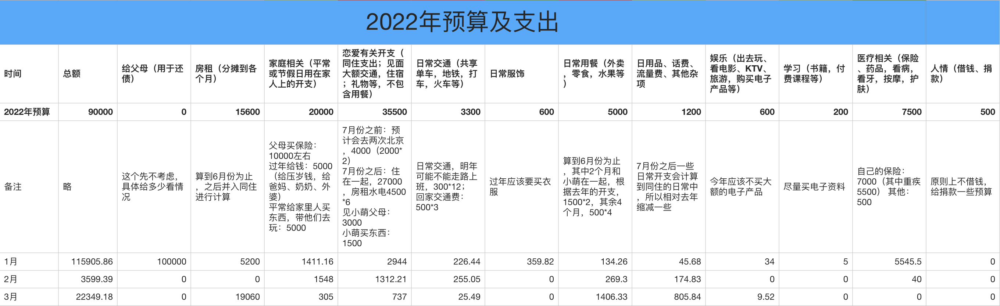

## 2022.03 开支情况

说明：

- 住房部分是换了租房，支出的三个月房租、一个房租的押金、中介费、搬家费
- 用餐部分是上海疫情肆虐，居家办公，所购买的粮食、蔬菜、肉等等
- 日用品部分主要是宽带费用，和搬新家后置办一些东西
- 恋爱部分主要是恋爱基金，给小萌的红包
- 家庭部分是琳琳中考报名费和妇女节给妈妈的红包
- 交通、娱乐部分开支较少，略。

三月份支出 **22349.18** 元。

预算余额还剩：70494.75 - 22349.18 = **48145.57**。

啊这，才过了三个月，预算就快消耗过半了。主要的增加就是房租，加上新房子的中介费、押金等，上半年总计需要支出 26360，而之前「上半年房租」的预算只有 15600，超支 10760 元。

四月因为疫情可能还有很长时间在家办公，希望四月开支尽可能少一些，制定一个 1020 的预算挑战，其中还有 520 是恋爱基金，所以其他的开支只有 500，我能完成这个挑战吗？