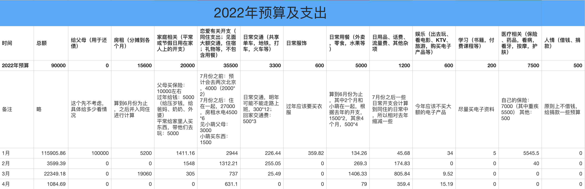

## 2022.04 开支情况

说明：

- 恋爱部分是萌鱼基金和给小萌买东西的钱
- 日用品部分是吸尘器分期还款
- 用餐部分是团购了一箱牛奶
- 娱乐部分是吃鸡加速器的费用

三月份支出 **1084.69** 元。

预算余额还剩：48145.57 - 1084.69 = **47060.88**。

上个月的 1020 挑战差一点点就成功，不过也很接近成功了，只超出了 64 元，还是很不错滴。