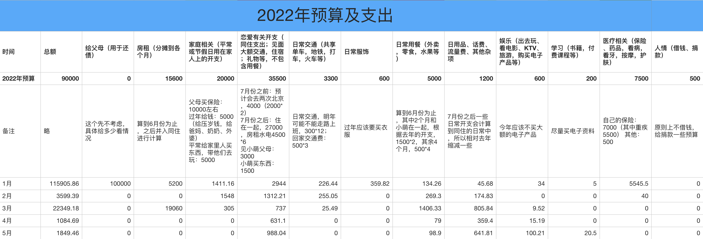

## 2022.05 开支情况

说明：

- 恋爱部分是 520、纪念日给小萌的红包和买东西、礼物的钱
- 日用品部分是吸尘器分期还款和 618 购物的一部分支出
- 用餐部分是在美团买菜上买了一些菜
- 娱乐部分是吃鸡加速器的费用
- 学习部分是买了本路遥的《早晨从中午开始》

五月份支出 **1849.46** 元。

预算余额还剩：47060.88 - 1849.46 = **45211.42**。

这个月的 1020 挑战没有成功，主要是 520、纪念日之类的日子有一些支出和 618 要买些东西。