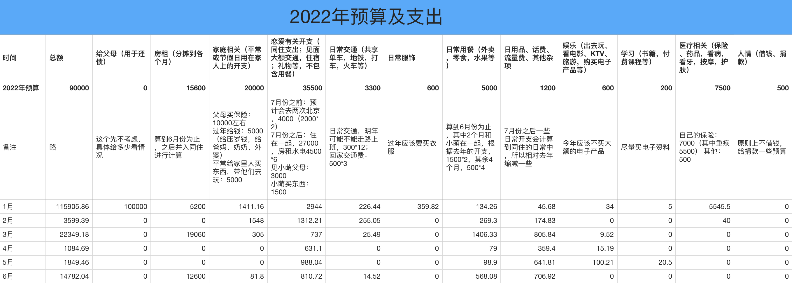

## 2022.05 开支情况

说明：

- 住房部分是 6.15 ~ 9.14 三个月的房租
- 恋爱部分主要是加班一半的钱给小萌
- 日用品部分是吸尘器分期还款和 618 购物的支出
- 用餐部分是这一个月吃饭、买菜等
- 家庭部分是帮妈妈买了些胶带
- 交通部分是打车的支出

六月份支出 **14782.04** 元。

预算余额还剩：45211.42 - 14782.04 = **30429.38**。

这个月主要开支还是在房租上。