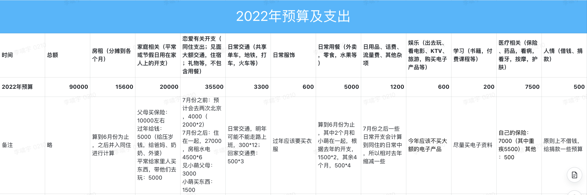

## 2022 年度预算

2022 年 预计收入 29 万，总结 2021 年的支出情况和 2022 年的各类可预知的事情，定下了 9 万的支出预算，希望自己 2022 年能够完成攒 20 万的目标。

## 2022 年开支

[2022 年 1 月](2022-1.md)

[2022 年 2 月](2022-2.md)

[2022 年 3 月](2022-3.md)

[2022 年 4 月](2022-4.md)

[2022 年 5 月](2022-5.md)

[2022 年 6 月]

[2022 年 7 月]

[2022 年 8 月]

[2022 年 9 月]

[2022 年 10 月]

[2022 年 11 月]

[2022 年 12 月]