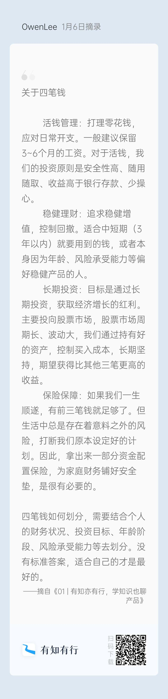

知行黑板报，每周二更新。

**投资是认知的变现。**

这句话有两方面的解释：
1. 你赚不到你认知之外的钱；
2. 光有理论是不够的，还要下场实操，把手弄脏。

### 活钱管理

在基金中，对应活钱需求的一般是货币基金。

另外，除了货币基金，市场上可以选择的高流动性产品还有很多，例如银行的活期理财。虽然这类产品收益率也在下滑，但整体比货币基金要有优势。比如招行的「活期+」板块下的一些产品，收益率约为 2.8%，有些还可以实现 T+0 赎回。中行、建行、农行等大银行都有类似的产品提供，收益率也差不多是这个水平。如果你的购买金额能达到 1 万元以上，这类产品就是替代货基很好的选择。

### 稳健理财

顾名思义，重点在于「稳健」：既想获得比货币类产品更高的收益，又不愿意承担股票类产品更高的风险。市场上讨论火热的「固收+」就是满足这类需求。

「固收+」中以固定收益类产品打底，主要投资收益相对更稳健的债券类资产。而「+」的是一些风险资产，期望博取更高收益。具体的风险资产包括股票、股指期货、国债期货、打新、定增、可转债等等，主理人自主选择。

### 长期投资

但需要提醒大家的是，短期市场不可预测，大家还是要站在长期的角度，规划好自己 3、5 年不会用到的钱，千万不要短钱长投。

