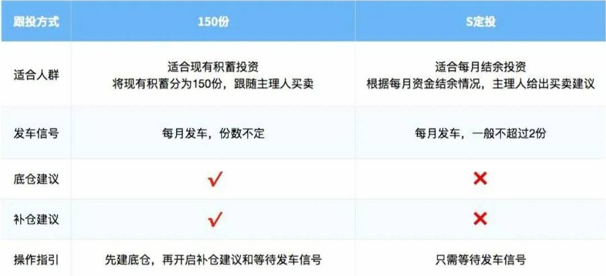

> 提问：
> 跟着 E 大买 S 定投已经两个多月了，收获颇丰！ 但是有一点我不是很明白，因为发车的时间间隔有时候会比较长，所以在这个期间会有攒下来多的钱进行投资等待下次发车。但因为之前确定的每份金额少（假设是 1000），而后面有多余资金将每份份额增加（假设 2000），那么会影响之前的收益吗？其次在想增加投资的情况下，是 `① 增加每份份额（从 1000 到 2000）` 还是 `② 购买两份（共计 2000）`更好？ 有什么区别？

且慢团队回答：

长赢 S 定投是主理人 E 大为手头没有一笔大额资金，想要通过未来每月工资结余参与基金投资的朋友设计的跟投模式。

不同于普通定投，S 定投是由 E 大在每月相对固定的时间（月中、月末），判断发车品种和数量 ，以此避免跟投者在估值偏贵的时候依然持续投入。

因此，**S定投虽名为定投，但其实每月是否投入，投入多少份都是不固定的。**

例如去年 2、3 月份市场大跌，S 定投两个月买入了 9 份； 6、7 月份市场大涨，两个月卖出 4 份。

情况一：

我们开启 S 定投后，有可能面临两三个月都无法买入的状态，这是由策略决定的正常情况，不需要因此修改金额增加投入。

我们可以每月把未投入的那笔资金放在活期产品中，未来再出现可以大笔买入的机会时也能跟上 E 大的节奏。

情况二：

另外一种情况是，随着收入的提升，**每月的结余增加**了，因此想要**增加 S 定投的投入**。 这种情况就可以**修改每份金额或者加倍买入**。

至于这两种方式怎么选，主要看你是想未来**每月都增加投入**，还是只是**偶尔有增加投入的需求**，前者选增加每份金额，后者选加倍买入。

那增加投入会影响之前的收益吗？

**增加投入不会影响之前的收益金额，但会影响收益率**。如果之前的持仓盈利的话，增加投入会拉低收益率，但后面上涨时收益金额则会比不增加投入的高。

对于普通投资者，**重要的是收益金额而不是收益率，不必因为收益率拉低而有太大的负担**。
