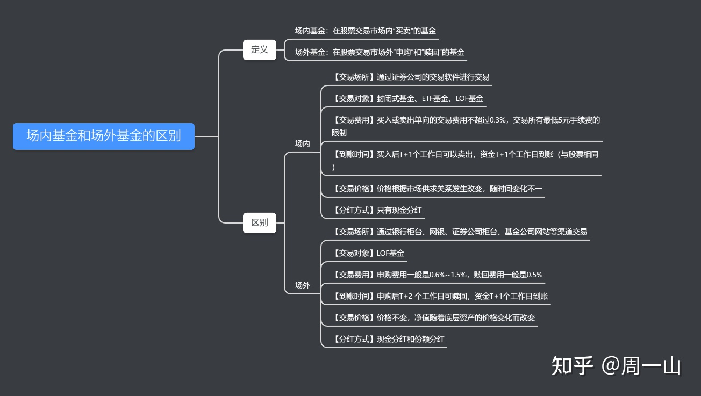

## 场外和场内

所谓的“场内”和“场外”，其实指的是“二级市场”的内外。

场内基金（Floor Fund），指的是在二级市场上交易的基金，其交易方式和股票相同，都是实时报价。从交易对象看，场内市场的交易对象是“投资人”-“投资人”，这点和股票也是一样的，实际上就是二级市场的资产在不同投资人之间流转。

场外基金（OTC Fund），指的是在二级市场之外的基金，如银行渠道、基金公司网站、各种平台（如支付宝等）上交易的基金。从交易对象看，场外市场的交易对象是“投资人”-“基金公司”，即“申购”和赎回都是发生在投资人和基金公司之间的。

PS：为了区分交易方式的不同，场内基金的交易称为“买”和“卖”，场外基金的交易称为“申购”和“赎回”。

除了交易场所的不同外，两者还有其他不同之处，见思维导图：

至于具体的投资人适合投资场内还是场外基金，则还要根据实际情况来分析。

简单来说：

场内交易对技术要求较高，适合有一定专业基础和市场经验的人购买。

场外交易由于渠道众多，操作便捷，加上可以定投的原因，适合小白或懒人投资。

