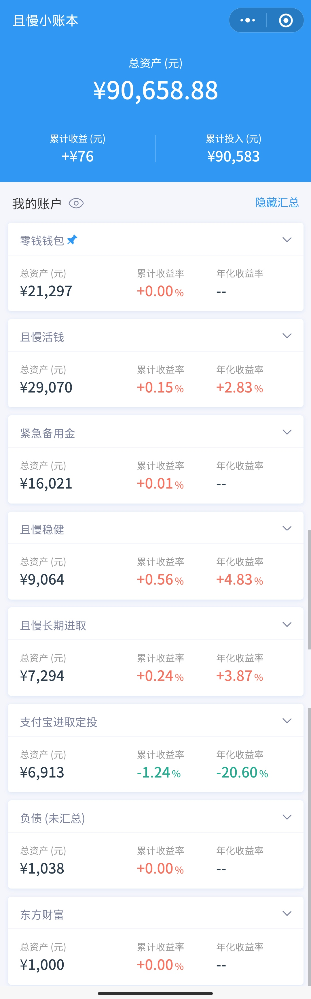

### 本周操作

- 1.27 打中新债上银转债，1000 元
- 1.26 1.28 各买入云长进取 900 元，各买入诸葛稳健 600 元，共计 3000 元

### 当前资产

这周收益大幅度下跌，基本上把之前涨的都跌进去了，上周的收益还是 700 多，这周的收益就只剩 70 多了。下跌时还加大补仓云长和诸葛，感觉有点草率了，因为数额比之前大，下周还有可能跌，账面浮亏还会扩大。

> 说明：
> 和上周相比的一个不同是新增了负债账户，但是且慢小账本并不支持负债账户，也去找了一些其他的记账软件，但是也没有且慢小账本这么可以直观反映出收益，所以就在小账本里新加了一个负债账户，数值是正数。`净资产 = 总资产 - 负债。`

所以当前净资产为：90658.88 - 1037.96 = 89620.92

