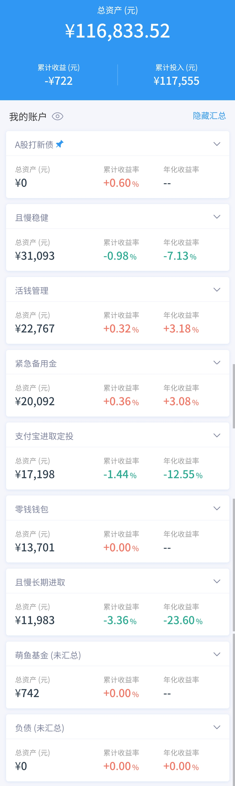

### 本周操作

- 2021-03-02 跟车诸葛稳健 800
- 2021-03-04 跟车诸葛稳健 600
- 2021-03-02 跟车诸葛稳健 1200
- 2021-03-04 跟车诸葛稳健 915.8
- 2021-03-02 【补仓】中证红利 200
- 2021-03-04 【补仓】中证红利 300
- 2021-03-04 【补仓】中证500 500
- 2021-03-09 【补仓】沪深300 100
- 2021-03-09 【补仓】国富天惠 100
- 2021-03-09 【补仓】中证500 100
- 2021-03-09 【补仓】中证红利 50
- 2021-03-09 【补仓】中概互联 50
- 2021-03-09 【补仓】兴全趋势 50
- 2021-03-03 活钱、备用金、零钱合并买了50000 14天定期，年化6%
- 2021-03-03 零钱买了5000 35天定期，年化6.08%

### 本周想法

上周因为基金大跌，所以就没有做实证（浮亏不忍直视）。
上次实证提到的不要经常盯盘和太在意每日盈亏，不过这两周还是没怎么做到，不过好像有所收敛，所以还是要不断给自己按摩，把精力放在更重要的事上。

### 当前资产

负债已经还清，当前净资产为：116833.52

