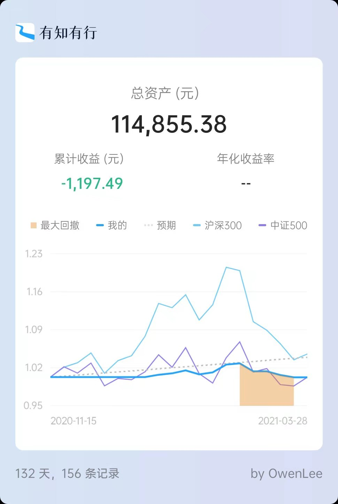

### 本周操作

- 2021-03-15【补仓】沪深300，中证500，富国天惠 各50
- 2021-03-15【补仓】中证红利，中概互联，兴全趋势 各25
- 2021-03-19【补仓】沪深300，中证500，富国天惠 各100
- 2021-03-19【补仓】中证红利，中概互联，兴全趋势 各50
- 2021-03-19【跟车】云长进取 900
- 2021-03-19【跟车】诸葛稳健 600
- 2021-03-19【跟车】S定投-全指信息一份 1000
- 2021-03-19 华泰14天定期取出

### 本周想法

本周震荡，之前的50000在华泰的定期里，没有到期，国师和E大发车都没跟上，好在周五钱到期取出时，正好是下跌的，补发一些车。

### 当前资产

