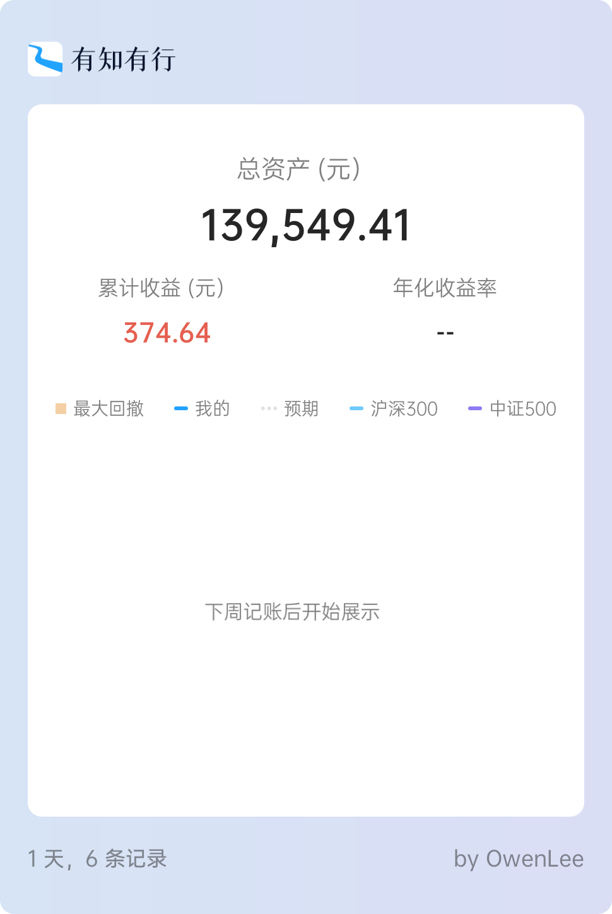

## 前言

临时补更。

今天终于在有知有行上把记账数据重新导入了，我在本地表格里留了一个买入卖出记录备份，之前的记录也可以回溯操作历史，所以这次就没有每笔记录都导入，而是一次性导入了各个分类下的总投入，然后更新了一波历史收益。活钱部分，变动比较频繁，应该有一些误差，把能追溯到收益都挑出来了，余额宝和微信零钱通的收益没有记录，就算了，差别不是很大。

这次的新账本，按照四笔钱的理念进行划分，分为三个账户，其中包含相同投资属性但是分散在不同平台的资产。目前的现状是：

- 活钱零钱
    - 备用金（且慢货币三佳）
    - 华泰证券（高息定期）
    - 招商银行（朝朝宝）
    - 微信（零钱通）
    - 东方财富（打新债）
- 稳健增值
    - 且慢稳健
        - 我要稳稳的幸福
        - 春华秋实
- 长期进取
    - 支付宝定投
        - 大成中证红利
        - 南方中证500
        - 易方达沪深300
        - 富国天惠
        - 兴全趋势
        - 易方达中概互联
        - 广发中证全指信息技术
    - 且慢长期
        - 长赢150份
        - 长赢S定投
        - 云长进取
        - 诸葛稳健
    - 蛋卷基金
        - 螺丝钉指数基金组合

## 本期操作

**支付宝定投**

- 2021-03-23【补仓】沪深300，中证500，富国天惠，中证红利 各100
- 2021-03-23【补仓】中概互联，兴全趋势 各50
- 2021-03-24【补仓】沪深300，中证500，富国天惠，中证红利 各50
- 2021-03-24【补仓】中概互联，兴全趋势 各25
- 2021-03-25【补仓】中证红利 75
- 2021-03-25【补仓】沪深300，中证500，富国天惠 各50
- 2021-03-25【补仓】中概互联，兴全趋势 各25
- 2021-03-26【补仓】沪深300，中证500，富国天惠，中证红利 各50
- 2021-03-26【补仓】兴全趋势 25
- 2021-03-30【补仓】沪深300，中证500，中证红利，兴全趋势 各50

- 2021-03-31 【定投】中证红利，中证500，沪深300，全指信息 各500
- 2021-03-31 【定投】富国天惠 550
- 2021-03-31 【定投】中概互联 275
- 2021-03-31 【定投】兴全趋势 200

**且慢长期**

- 2021-03-23【跟车】云长进取 900
- 2021-03-23【跟车】诸葛稳健 600
- 2021-04-09【跟车】云长进取 1000
- 2021-04-09【跟车】诸葛稳健 700
- 2021-04-16【跟车】云长进取 1000
- 2021-04-16【跟车】诸葛稳健 700
- 2021-04-16【跟车】S定投 1000
- 2021-04-16【跟车】150份 100

**螺丝钉指数组合**

- 2021.03.23 【跟车】螺丝钉指数 1012.2
- 2021.03.30 【跟车】螺丝钉指数 987.8
- 2021.04.06 【跟车】螺丝钉指数 1000
- 2021.04.12 【跟车】螺丝钉指数 200
- 2021.04.13 【跟车】螺丝钉指数 1000
- 2021.04.20 【跟车】螺丝钉指数 1000

**且慢稳健**

- 2021-03-31 【定投】稳稳的幸福 2000
- 2021-03-31 【定投】春华秋实 2000

**活钱**

- 2021-03-25 【定投】备用金 3000
- 2021-03-31 【定投】备用金 2000
- 2021-04-06 华泰证券5000定期本息取出
- 2021-04-06 华泰证券存入15000元273天定期

## 当前资产

