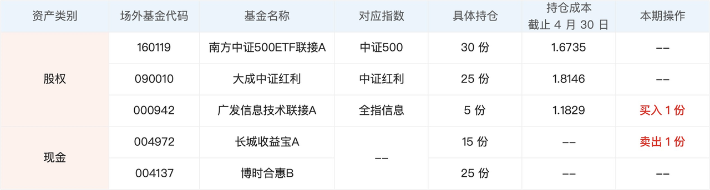
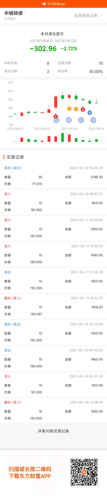
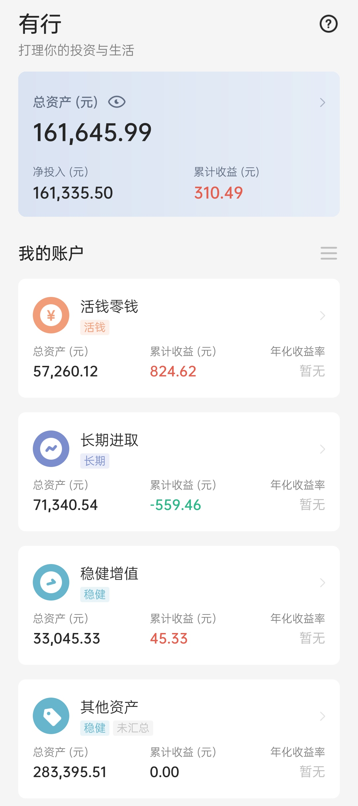

## 本期操作

**长期**
- 2021-05-10【跟车】云长进取 1000 诸葛稳健 700
- 2021-05-11【跟车】螺丝钉指数基金组合 1000
- 2021-05-10【跟车】云长进取 1000 诸葛稳健 700
- 2021-05-13【补仓】中证红利，中证500 各500
- 2021-05-13【补仓】沪深300，富国天惠 各200
- 2021-05-13【补仓】兴全趋势 100

## 有行黑板报跟车情况

接上一期，这期中证红利和中证500各补一份，当前的跟车情况如下：

| 指数 | 当前份数 | 目标份数 |
| :--- | :--- | :--- |
| 中证500 | 15 | 30 |
| 中证红利 | 16 | 25 |
| 全指信息 | 5 | 5 |

## 中钢转债的亏

之前打中东财转3的可转债，在东方财富的股吧中看到很多讨论中钢的涨势很好，然后去看发现短短一天就从130涨到了170，所以就有了做T的想法，低价买入、高价卖出，和股票一样。5月11日，以181，183，190.687一张的价格各买入一手（1手10张），以186，192, 192的价格卖出，当天盈利153元左右。所以是尝到了甜头，之后又买入3手，但是从12号开始这个转债的价格就开始持续下跌，最终割肉卖出，总亏损 302.96元。

从这个事件看出，自己还是有很强的从众心理，别人觉得这个转债好，会涨，就跟着想低买高卖了，其实自己对这个转债一点都不了解，**挣不到认知之外的钱**，真是太正确了。

所以之后还是老老实实打新，上市就直接卖出。

## 当前资产

