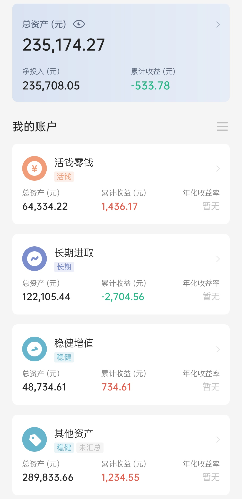

## 本期操作

### 长期进取

| 时间 | 操作 | 金额 |
| :-- | :-- | :-- |
| 2021.6.30 | 【跟车】螺丝钉基金组合| 1000 |
| 2021.7.1 | 【定投】沪深300、中证500、富国天惠、兴全趋势 | 4000（各1000） |
| 2021.7.1 | 【定投】中证红利 | 500 |
| 2021.7.2 | 【补仓】沪深300、中证500、中概互联、兴全趋势、富国天惠、中证红利 | 3000（各500） |
| 2021.7.2 | 【跟车】云长进取| 1000 |
| 2021.7.2 | 【跟车】诸葛稳健| 700 |
| 2021.7.2 | 【跟车】螺丝钉基金组合| 200 |
| 2021.7.6 | 【跟车】螺丝钉基金组合| 1000 |
| 2021.7.8 | 【跟车】螺丝钉基金组合| 200 |
| 2021.7.8 | 【补仓】中概互联、海外互联网| 1000（各500） |
| 2021.7.9 | 【跟车】云长进取| 1000 |
| 2021.7.9 | 【跟车】诸葛稳健| 700 |
| 2021.7.13 | 【跟车】螺丝钉基金组合| 1000 |
| 2021.7.13 | 【跟车】S定投 | 1000 |
| 2021.7.16 | 【跟车】S定投 | 1000 |
| 2021.7.20 | 【跟车】螺丝钉基金组合| 1000 |
| 2021.7.27 | 【补仓】沪深300、中证500、中概互联、海外互联网、富国天惠、中证红利、中证养老 | 3500（各500） |
| 2021.7.27 | 【跟车】云长进取| 2000 |
| 2021.7.27 | 【跟车】诸葛稳健| 1400 |
| 2021.7.27 | 【跟车】螺丝钉基金组合| 1500 |
| 2021.7.27 | 【跟车】S定投 | 1000 |
| 2021.7.27 | 【跟车】150份 | 100 |
| 2021.7.30 | 【定投】沪深300、富国天惠 | 2000（各1000） |
| 2021.7.30 | 【定投】中证500 | 950 |
| 2021.7.30 | 【定投】兴全趋势、中概互联、海外互联网 | 1500（各500） |
| 2021.7.30 | 【跟车】螺丝钉基金组合| 460 |

### 稳健增值

| 时间 | 操作 | 金额 |
| :-- | :-- | :-- |
| 2021.7.2 | 【定投】稳稳的幸福 | 2000 |
| 2021.7.2 | 【定投】春华秋实 | 3000 |
| 2021.7.30 | 【定投】稳稳的幸福、春华秋实、安心动盈 | 6000（各2000） |

## 当前资产

