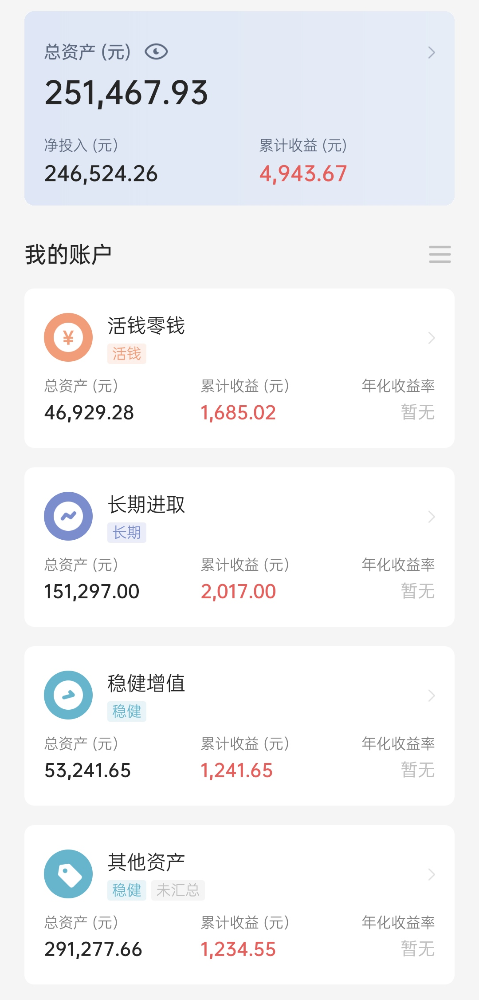

## 本期操作

### 长期进取

| 时间 | 操作 | 金额 |
| :-- | :-- | :-- |
| 2021.8.3 | 【跟车】螺丝钉基金组合 | 1100 |
| 2021.8.10 | 【跟车】螺丝钉基金组合 | 1100 |
| 2021.8.13 | 【跟车】云长进取| 1000 |
| 2021.8.13 | 【跟车】诸葛稳健| 700 |
| 2021.8.17 | 【跟车】螺丝钉基金组合 | 1100 |
| 2021.8.17 | 【补仓】沪深300、富国天惠、中证养老 | 1500（各500） |
| 2021.8.17 | 【补仓】中概互联、海外互联网 | 500（各250） |
| 2021.8.18 | 【跟车】S定投（海外互联网） | 1000 |
| 2021.8.20 | 【补仓】沪深300 | 750 |
| 2021.8.20 | 【补仓】中概互联、海外互联网 | 500（各250） |
| 2021.8.20 | 【补仓】中证500、富国天惠 | 1000（各500） |
| 2021.8.20 | 【跟车】螺丝钉基金组合 | 600 |
| 2021.8.20 | 【跟车】云长进取| 1000 |
| 2021.8.20 | 【跟车】诸葛稳健| 700 |
| 2021.8.24 | 【跟车】螺丝钉基金组合 | 1100 |
| 2021.8.26 | 【跟车】螺丝钉基金组合 | 220 |
| 2021.8.26 | 【追车】S定投（中证传媒） | 1000 |
| 2021.8.27 | 【跟车】S定投（文体娱乐） | 1000 |
| 2021.8.30 | 【跟车】S定投（中证传媒） | 1000 |
| 2021.8.30 | 【跟车】150份（中证传媒） | 100 |
| 2021.8.31 | 【定投】沪深300、中证500、富国天惠 | 3000（各1000） |
| 2021.8.31 | 【定投】中证养老、海外互联网、中概互联、兴全趋势 | 2000（各500） |
| 2021.8.31 | 【跟车】螺丝钉基金组合 | 1400 |
| 2021.8.31 | 【追车】S定投（恒生指数） | 1000 |
| 2021.8.31 | 【跟车】150份（富国消费主题） | 100 |

### 稳健增值

| 时间 | 操作 | 金额 |
| :-- | :-- | :-- |
| 2021.8.31 | 【定投】春华秋实、安心动盈 | 4000（各2000） |

## 当前资产

终于把投资实证补回来了，之后每周固定更新。

