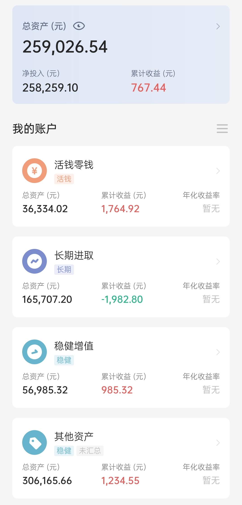

### 本期操作

| 时间 | 操作 | 金额 |
| :-- | :-- | :-- |
| 2021.10.11 | 【定投】兴全趋势、中证500 | 1000，各500 |
| 2021.10.11 | 【定投】富国天惠、沪深300 | 2000，各1000 |
| 2021.10.13 | 【跟车】中证养老、全指信息 | 1000，各500 |
| 2021.10.13 | 【补仓】海外互联网 | 50 |

### 投资计划变更

螺丝钉指数基金组合跟投停止。

### 当前资产

