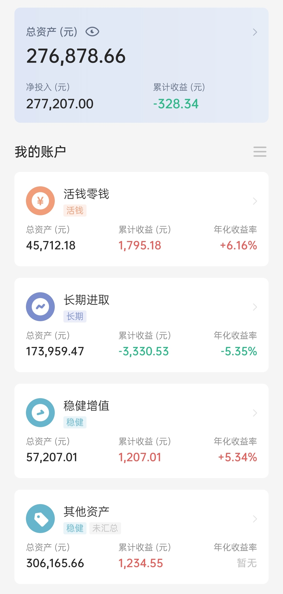

### 本期操作

| 时间 | 操作 | 金额 |
| :-- | :-- | :-- |
| 2021.10.27 | 【追车】S定投-恒生指数 | 2000 |
| 2021.10.27 | 【补仓】中概互联 | 500 |
| 2021.10.27 | 【跟车】螺丝钉组合 | 250 |
| 2021.10.27 | 【补仓】海外互联网 | 250 |
| 2021.10.28 | 【定投】沪深300、中证500、富国天惠 | 3000，各1000 |
| 2021.10.28 | 【跟车】云长进取 | 800 |
| 2021.10.28 | 【跟车】云长进取 | 700 |

### 当前资产

