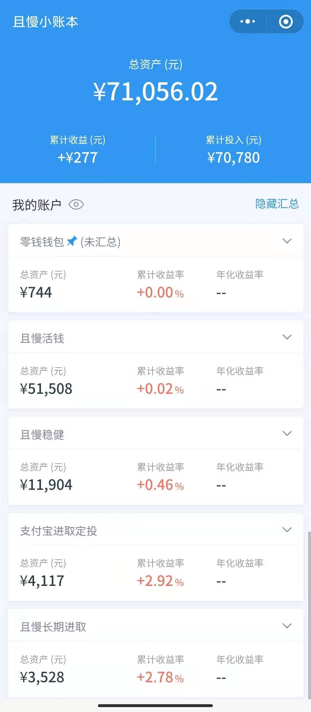

## 2021-01-10 财务实证

### 2021 理财规划

这几天确定了 2021 年的理财规划：

日期：每月 1 号定投 + 不定期跟投

#### 支付宝基金定投

这个定投是进取型的。

**来自有知有行**

定投沪深 300（易方达沪深 300ETF 联接 A，110020） 和中证 500（南方中证 500ETF 链接 A，160119）
看有知有行App中的股票温度计选择 0 份，1 份还是 2 份，1 份基额 500 元
再加支付宝的智慧定投（基额的 60%～210%）

**来自也谈钱**

兴全趋势，163402，基额 1000，智慧定投
国富天惠成长混合（LOF）A，161005，基额 1000，智慧定投

#### 且慢长期

进取型。

**来自刘备教授**

云长进取:
每月 1000 元，按发车信号跟投，每月大约分三次跟投，每次比例 4:3:3

**长投：来自 E 大（低优先级）**

S 定投：每月800
150 份：总额 15000，每份 100 元
按信号跟投，不定期，要保证盈米宝中有一定活钱

#### 且慢稳健

我要稳稳的幸福 每月 1 号定投 2000
马拉松固收增强 每月 1 号定投 2000
诸葛稳健 每月1000 按信号跟投，每月大约分三次跟投，比例 4:3:3

#### 活钱 

[普通]货币三佳 每月 4000 元
[备用金]货币三佳每月 1000 元，存到总额 50000
盈米宝 留到 10000 元

#### 零钱钱包

剩余钱一半放余额宝（支付宝），一半放零钱通（微信），用于日常支出。

### 当前资产
