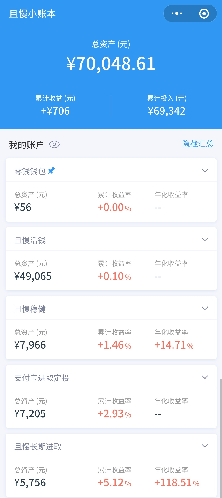

### 本周操作

- 1.20 买入 500 中证 500；
- 1.21 买入 2500 中证红利；(原因是红利的温度是 0 度，看孟岩买入了 10 万，积累仓位，所以就加投了一些)
- 1.22 买入 400 云长进取；
- 1.22 买入 400 诸葛稳健；

### 当前资产

> 说明：
> 之前零钱钱包中的钱都没有计入总资产中，原因是我记录的方式有些问题，每周做快照时，是用的当前资产，这会计算到收益中去，但我这里其实只想要一个总数而已。这次调整了一下，转入和转出是不会计算到收益中的，所以以后每次快照时，就是记录一笔 `上周余额 - 当前余额` 的支出，这样就可以保证累计收益是正确的。

