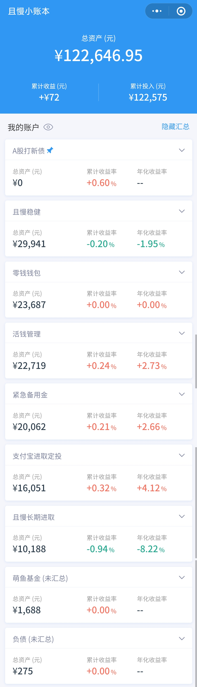

### 本周操作

- 2021-02-23 跟车诸葛稳健 600
- 2021-02-23 跟车云长进取 808.36
- 2021-02-26 【每月定投】沪深300 1000
- 2021-02-26 【每月定投】中证500 1000
- 2021-02-26 【每月定投】富国天惠 1000
- 2021-02-26 【每月定投】中证红利 500
- 2021-02-26 【每月定投】中概互联
- 2021-02-26 【每月定投】稳稳的幸福 2000
- 2021-02-26 【每月定投】春华秋实 5000

### 本周想法

自从开始买基金理财以来，每天都会频繁地打开自己的基金 App，白天看大盘涨跌，晚上看今天涨了或跌了多少。之前想完成的理财入门书籍的笔记反而一直拖了很久，技术上的学习也停滞了。且慢的 slogan 是「放下焦虑，全情生活」，但我最近却是完全相反的，整个人都好像扑在了这个上面，平白多出很多额外的情绪，涨时洋洋自得，跌时愁眉苦脸，并且非常焦虑，是一种很不好很不健康的状态。

我需要摆脱这种状态，不是去计较每天的涨跌，而是好好学习理财的基本知识，提升自己的认知。此外，把时间留给工作和学习。给自己定一个约定，下周一周，除了操作打新和跟车必要的操作，此外不看任何的收益和大盘。下周末写实证时，进行复盘。

### 当前资产

当前净资产为：122646.95 - 274.91 = 122372.04

