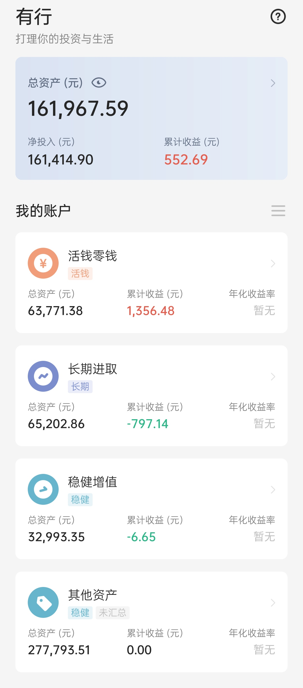

## 本期操作

**长期**
- 2021-05-06【定投】中证红利，中概互联，兴全趋势 各500
- 2021-05-06【定投】中证500，沪深300，富国天惠 各1000
- 2021-05-06【跟车】螺丝钉指数基金组合 200
- 2021-05-06【跟车】有行黑板报：全指信息 1000
- 2021-05-06【补仓】中证红利 550

**稳健**
- 2021-05-06【定投】稳稳的幸福，春华秋实 各2000

**活钱**
- 2021-05-06【定投】备用金（货币三佳） 各2000

## 有行黑板报跟车情况

最近统计了一下有行黑板报的跟车情况：

我的一份是500元，目前跟着黑板报买的中证500，中证红利，全指信息份数如下：

| 指数 | 当前份数 | 目标份数 |
| :--- | :--- | :--- |
| 中证500 | 14 | 30 |
| 中证红利 | 15 | 25 |
| 全指信息 | 5 | 5 |

之后还需要慢慢补到和黑板报一致的仓位。

## 当前资产

