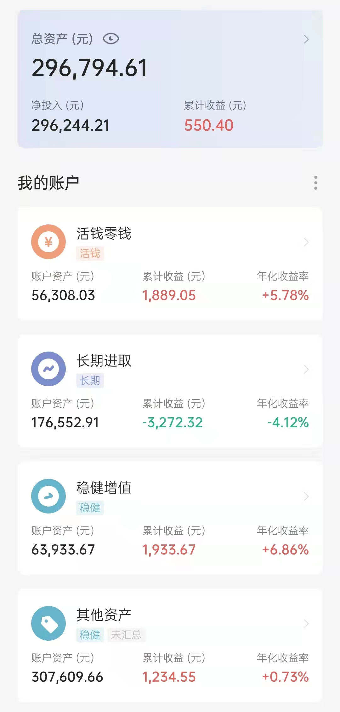

### 本期操作

| 时间 | 操作 | 金额 |
| :-- | :-- | :-- |
| 2021.11.22 | 【补仓】中概互联 | 500 |
| 2021.11.26 | 【卖出】螺丝钉指数基金组合债基 | -7164.77 |
| 2021.11.30 | 【定投】沪深300，中证500 | 2000（各1000） |
| 2021.11.30 | 【定投】富国天惠 | 500 |
| 2021.11.30 | 【定投】春华秋实 | 2000 |
| 2021.12.03 | 【跟车】S定投-恒生指数 | 1000 |
| 2021.12.03 | 【跟车】150份-恒生指数 | 100 |
| 2021.12.03 | 【追车】S定投-华宝油气 | 1000 |

### 当前资产

