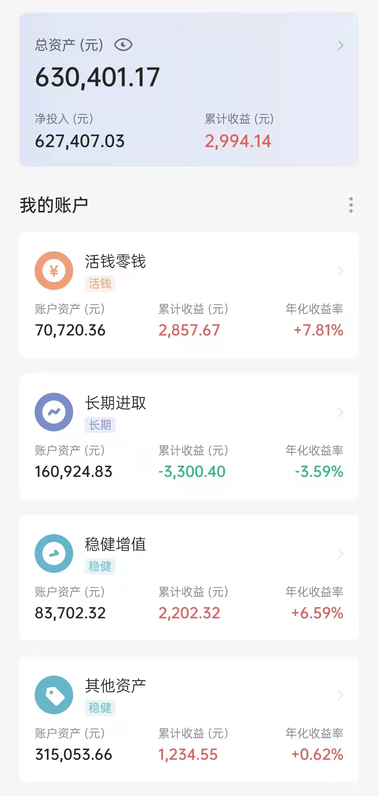

### 本期操作

| 时间 | 操作 | 金额 |
| :-- | :-- | :-- |
| 2021.12.28 | 【跟车】黑板报-中概互联 | 500 |
| 2021.12.29 | 【定投】沪深300、中证500、富国天惠 | 1500，各500 |

### 当前资产

### 2021 年投资总结

今年光从收益来说是很少的，长期投资账户还是浮亏的，全靠零钱活钱账户的各种定期理财和打新债以及稳健增值账户的收益撑着才实现正收益。

长期投资账户中，跌的最多的就是中概股相关的基金，在支付宝上购买的中概互联都浮亏了30%，基本上就是从最高点开始一直跌。不过对于中概股，我目前的心态还是蛮好的，还在想着抄底加仓，摊平成本。这种心态的底气大概来自 E 大 [第二、第三道投资数学题；应用题——中概](https://mp.weixin.qq.com/s/blbcvoeK0Ed-sOlIEvebuw) 文章中写的，这是个不死的品种，长期来看，我相信这些互联网公司是中国的优质资产。

今年在投资的心态上还是有很明显的变化的，从一开始只买了一点点基金，每天都因为几十块钱的涨跌而心神不宁；到后来开始找各种投资组合，希望跟上大 V 的车；再到后面开始希望自己把握时点，企图在下跌时抄底；再到年底时，发现自己的资产配置已经严重不平衡，急需改变。

今年跟了很多基金组合，让更专业的人来帮我管理资金。

具体有：
- 长期进取
    - 长赢 S 定投
    - 长赢 150 份
    - 云长进取
    - 螺丝钉指数基金组合
    - 有知有行 黑板报
    - 有知有行 温度计
- 稳健增值
    - 诸葛稳健
    - 春华秋实
    - 安心动盈
    - 稳稳的幸福

还有自己买的几个主动基金：

- 富国天惠（来自也谈钱的推荐）
- 兴全趋势（来自也谈钱的推荐）
- 中概互联、海外互联网

可以看到，我跟的组合特别分散，这使得我把过多的资金投入到长期进取这个账户中，让我三笔钱（零钱活钱，稳健增值、长期进取）的比例严重失调，长期进取占总资金的比例一度达到 2/3。活钱比较少，需要临时使用大额资金时，就不得不卖出基金（年末就遇到了这个事情）。偏股型的基金占了大头，波动程度变大，风险也变高。有时遇上大跌时，一天大概要浮亏2000左右，对心态也是一个考验。另外这也让我的钱分散在各个基金购买平台，比如支付宝、且慢、蛋卷等，日常的资产更新也很不方便。

另一个方面，就跟的这些基金组合来说，体验比较好的有：

- 长赢 S 定投
- 长赢 150 份
- 有知有行 黑板报
- 有知有行 温度计
- 春华秋实
- 我要稳稳的幸福
- 安心动盈

体验不怎么好的有：

- 云长进取
- 诸葛稳健
- 螺丝钉指数基金组合

长赢和有知有行的投资思路是比较类似的，核心是【好资产+好价格=好收益】，把资金分成一份一份，低估时买入，高估时卖出。这种对跟车是很友好的，可以中途厂车，只买其中几个品种，错过一些车，也可以在不超过主理人持有净值的情况下进行追车。稳健投资的几个基金组合都很不错，拿着很安心。

云长和诸葛，这一年拿的比较闹心，没有很亮眼的成绩（跟上车时机也有关系，买在了高点），并且云长的波动性真的蛮大的，而且很多基金都是风格变了开始割肉卖出，云长至今已经割肉了400多元，这个让我很难受。

螺丝钉的投资逻辑其实也是蛮不错的，总的来说是走的低估买入、中估持有、高估卖出这个路线，不过有个让人很不爽的是，这个组合感觉是一开始跟车就很难停下来的那种，不然就不能跟着主理人摊平成本，自己的收益和组合收益根本对不上，而且它是每周固定发车，需要不断投入现金，比较消耗现金流。另外感觉择时也不是准确，以中概股为例，感觉买早了，等他这边买入跌了25%左右，有知有行黑板报才开始出手买入。

### 2022 年的投资计划

新的一年里，为了避免去年的一些问题，我准备还是遵循四笔钱的资产配置理念，参考也谈钱的 [50 万本金，应该咋配置？](https://mp.weixin.qq.com/s/8onR2i8yQ71VmE3gvbJtqA) 文章来把各个水池都注满。

具体到执行层面来说：

- 今年会把去年持有体验不太好的组合舍弃掉，比如诸葛稳健、螺丝钉指数基金组合等。
- 优先把活钱的池子配置满，比如招行的朝朝宝 5 万存满，备用金和保险等也配置妥当，配合打新债等方式提高活钱收益率。
- 稳健增值、长期进取账户中，持有体验好的组合或主动基金保持定投或跟车。
- 控制活钱、稳健、长期资产的比例保持在一个比较平衡的比例。
- 系统学习，多看经典的投资书籍，保持耐心。