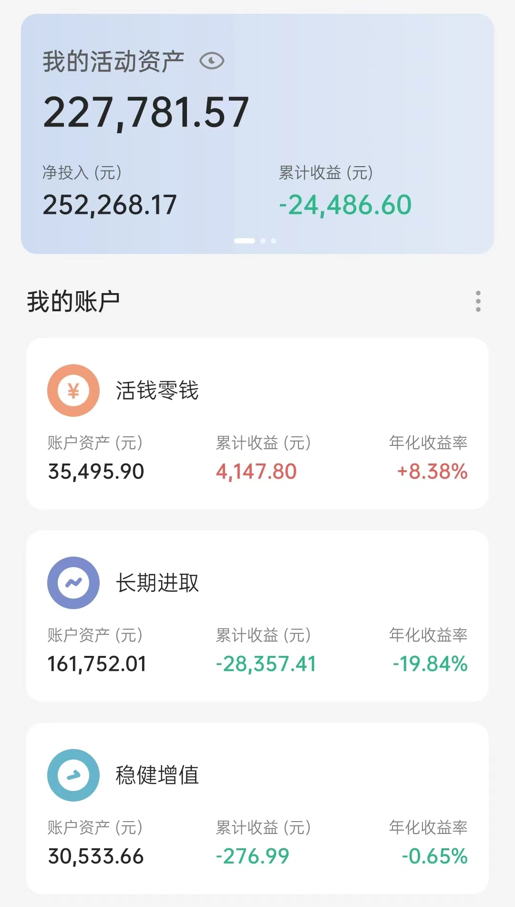

# 2022-04-06 实证记录

## 长期进取

| 时间 | 操作 | 品种 | 金额 |
| :-- | :-- | :-- | :-- |
| 1.5 | 卖出 | 螺丝钉 | 8336.33 |
| 1.13 | 买入（跟车） | 云长进取 | 800 |
| 1.19 | 买入（跟车） | 云长进取 | 800 |
| 1.24 | 买入（跟车） | S定投（全指医药） | 1000 |
| 1.25 | 买入（跟车） | 150份（全指医药）| 100 |
| 1.25 | 买入（定投） | 温度计（沪深300、中证500）| 2000 |
| 1.25 | 买入（定投） | 自选（富国天惠） | 500 |
| 1.26 | 买入（追1.11车 ） | 黑板报（中国互联网）| 500 |
| 1.26 | 买入（跟车） | 黑板报（前沿医疗） | 500 |
| 1.28 | 买入（跟车） | 黑板报（前沿医疗、中国互联网） | 1000 |
| 1.28 | 买入（补仓） | 自选（中概互联） | 500 |
| 2.9 | 买入（跟车） | S定投（恒生科技） | 1000 |
| 2.9 | 买入（跟车） | 150份（恒生科技）| 100 |
| 2.14 | 卖出（跟车） | 150份（十年国债） | 107.48 |
| 2.22 | 买入（追车） | 黑板报（前沿医疗） | 500 |
| 3.1 | 买入（定投） | 温度计（沪深300*2、中证500*2）| 2000 |
| 3.1 | 买入（跟车） | 黑板报（中国互联网）| 500 |
| 3.1 | 买入（定投） | 自选（富国天惠、兴全趋势）| 1000 |
| 3.2 | 买入（跟车） | 螺丝钉组合 | 750 |
| 3.7 | 买入（跟车） | S定投（恒生指数） | 1000 |
| 3.7 | 买入（跟车） | 150份（恒生指数） | 100 |
| 3.7 | 买入（补仓） | 自选（中概互联） | 500 |
| 3.8 | 买入（跟车） | 150份（德国DAX*2、养老指数*7、恒生指数*2） | 1100 |
| 3.8 | 买入（跟车） | 黑板报（前沿医疗、全指信息） | 1000 |
| 3.8 | 买入（补仓） | 自选（富国天惠） | 500 |
| 3.8 | 买入（跟车） | 螺丝钉组合 | 1080 |
| 3.9 | 买入（跟车） | 150份（恒生指数） | 100 |
| 3.11 | 买入（跟车） | 150份（金融地产） | 100 |
| 3.15 | 买入（跟车） | S定投（恒生指数） | 1000 |
| 3.15 | 买入（跟车） | 150份（恒生指数*5） | 500 |
| 3.15 | 买入（跟车） | 黑板报（中证养老、全指信息） | 1000 |
| 3.15 | 买入（跟车） | 螺丝钉组合 | 990 |
| 3.16 | 买入（跟车） | 150份（恒生指数*2） | 200 |
| 3.16 | 卖出（跟车） | S定投（华宝油气） | 1311.57 |
| 3.18 | 买入（跟车、追车） | S定投（富国消费、恒生科技、易方达债券） | 3000 |
| 3.18 | 买入（跟车、追车） | 150份（富国消费、恒生科技） | 200 |
| 3.21 | 卖出（跟车） | 150份（中证环保） | 140.43 |
| 3.21 | 买入（跟车） | 云长进取 | 800 |
| 3.23 | 买入（跟车） | 螺丝钉组合 | 680 |
| 3.28 | 买入（跟车） | 云长进取 | 800 |
| 3.28 | 买入（定投） | 温度计（沪深300*2、中证500*2）| 2000 |
| 3.28 | 买入（定投） | 自选（富国天惠、兴全趋势）| 1000 |
| 3.29 | 买入（跟车） | 螺丝钉组合 | 680 |
| 4.8 | 买入（跟车） | S定投（全指信息、养老指数） | 2000 |
| 4.12 | 买入（跟车） | 150份（信息产业） | 100 |
| 4.13 | 买入（跟车） | 螺丝钉组合 | 700 |
| 4.14 | 买入（跟车） | 150份（大摩健康） | 100 |
| 4.14 | 买入（跟车） | S定投（全指医药） | 1000 |

## 稳健增值

| 时间 | 操作 | 品种 | 金额 |
| :-- | :-- | :-- | :-- |
| 1.6 | 卖出 | 安心动盈 | 8108.33 |
| 1.7 | 卖出 | 诸葛稳健 | 15752.24 |
| 1.11 | 卖出 | 稳稳的幸福 | 20815.24 |
| 1.11 | 卖出 | 春华秋实 | 14813.54 |
| 1.13 | 买入（跟车） | 诸葛稳健 | 200 |
| 1.19 | 买入（跟车） | 诸葛稳健 | 200 |
| 3.1 | 买入（定投） | 春华秋实 | 2000 |
| 3.2 | 买入（定投） | 稳稳的幸福 | 2000 |
| 3.21 | 买入（跟车） | 诸葛稳健 | 200 |
| 3.28 | 买入（定投） | 春华秋实 | 2000 |
| 3.28 | 买入（定投） | 稳稳的幸福 | 2000 |
| 3.28 | 买入（跟车） | 诸葛稳健 | 200 |

## 当前资产

这么久没有更新主要就是因为最近的行情实在太惨了，竟然浮亏了近 3 万。

