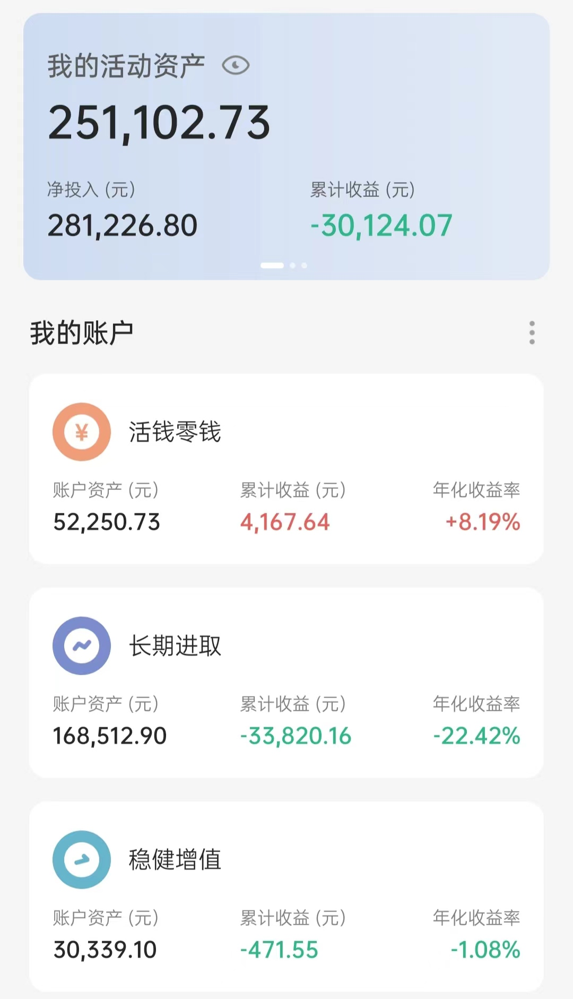

# 2022-04-06 实证记录

## 长期进取

| 时间 | 操作 | 品种 | 金额 |
| :-- | :-- | :-- | :-- |
| 4.19 | 买入（跟车） | 螺丝钉组合 | 680 |
| 4.22 | 买入（跟车） | S定投（养老产业、健康产业） | 2000 |
| 4.22 | 买入（跟车） | 150份（信息技术） | 100 |
| 4.25 | 买入（跟车） | S定投（养老产业） | 1000 |
| 4.25 | 买入（追车） | 150份（债券） | 1000 |
| 4.26 | 买入（跟车） | 黑板报（沪深300，创业板指） | 1000 |
| 4.26 | 买入（定投） | 自选（富国天惠） | 1000 |
| 4.26 | 买入（定投） | 自选（兴全趋势）| 500 |
| 4.26 | 买入（定投） | 自选（中概互联） | 300 |
| 4.26 | 买入（定投） | 温度计（沪深300、中证500）| 2000 |
| 4.26 | 买入（跟车） | S定投（信息技术、文体娱乐） | 2000 |
| 4.26 | 买入（跟车） | 150份（信息技术、中证500） | 200 |
| 4.27 | 买入（跟车） | 螺丝钉组合 | 760 |
| 4.27 | 卖出（跟车） | 150份（易方达高等级信用债） | 104.44 |
| 4.28 | 卖出（跟车） | 150份（华宝油气） | 211.92 |

## 长期进取

无操作

## 当前资产

最近上证指数跌破 3000 点，既为大量的亏损感到心痛，又激动到了 E 大所说的钻石坑，有知有行温度计也到了 0 度，这次加了差不多一万块钱，后面两天开始涨了后想着是不是没加够，应不应该多加点。修炼还是不到位呀。

