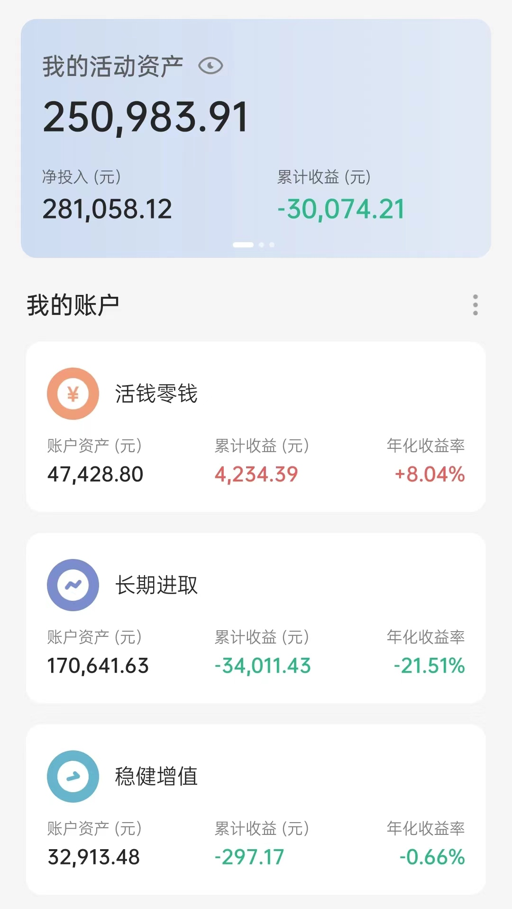

# 2022-05-15 实证记录

## 长期进取

| 时间 | 操作 | 品种 | 金额 |
| :-- | :-- | :-- | :-- |
| 5.6 | 买入（跟车） | 云长进取 | 1600 |
| 5.11 | 买入（跟车） | 螺丝钉组合 | 720 |

## 稳健增值

| 时间 | 操作 | 品种 | 金额 |
| :-- | :-- | :-- | :-- |
| 5.6 | 买入（跟车） | 诸葛稳健 | 400 |
| 5.6 | 买入（定投） | 春华秋实 | 2000 |

## 当前资产

