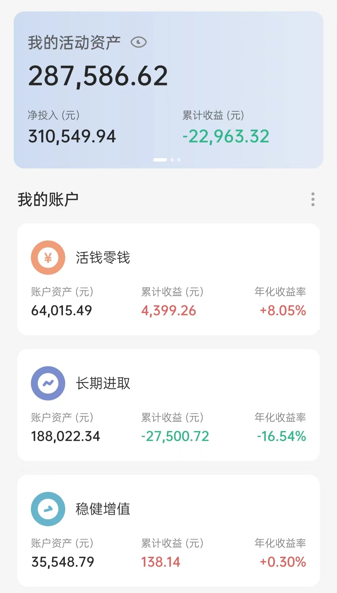

# 2022-05-31 实证记录

## 长期进取

| 时间 | 操作 | 品种 | 金额 |
| :-- | :-- | :-- | :-- |
| 5.16 ～ 5.20 | 买入（定投） | 富国天惠 150，兴全趋势 150 | 300 |
| 5.17 | 买入（跟车） | 黑板报 沪深300 500，前言医疗 500 | 1000 |
| 5.19 | 买入（跟车） | 螺丝钉组合 | 720 |
| 5.25 | 买入（跟车） | 螺丝钉组合 | 720 |
| 5.25 | 买入（跟车） | 云长进取 | 800 |
| 5.31 | 买入（跟车） | 螺丝钉组合 | 730 |
| 5.31 | 买入（定投） | 富国天惠 500，兴全趋势 500，中概互联 300，沪深300 1000，中证500 1000  | 3300 |
| 5.31 | 买入（跟车） | S定投 3000，150份 300  | 3300 |

## 稳健增值

| 时间 | 操作 | 品种 | 金额 |
| :-- | :-- | :-- | :-- |
| 5.25 | 买入（跟车） | 诸葛稳健 | 200 |
| 5.31 | 买入（定投） | 春华秋实 | 2000 |

## 当前资产

