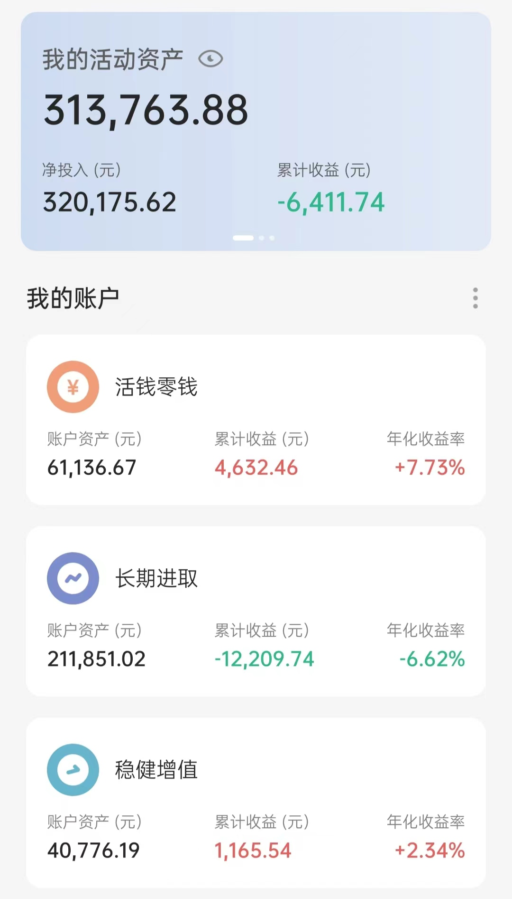

# 2022-07-02 实证记录

## 长期进取

| 时间 | 操作 | 品种 | 金额 |
| :-- | :-- | :-- | :-- |
| 6.1 | 卖出（跟车） | 150 份（7-10年国开债） | 108.67 |
| 6.8 | 买入（跟车） | 螺丝钉组合 | 680 |
| 6.10 | 买入（跟车） | S定投（医药卫生） 1000，150份（大摩健康） 100 | 1100 |
| 6.14 | 买入（跟车） | 云长进取 | 800 |
| 6.15 | 买入（跟车） | 螺丝钉组合 | 690 |
| 6.21 | 买入（跟车） | 螺丝钉组合 | 660 |
| 6.10 | 买入（跟车） | 150份（标普500） | 100 |
| 6.29 | 买入（跟车） | 螺丝钉组合 | 620 |
| 6.30 | 卖出（跟车） | 150 份（德国 DAX） | 103.63 |
| 7.2 | 买入（跟车） | S定投（生物科技） 1000，150份（生物科技） 100 | 1100 |
| 7.2 | 买入（定投） | 富国天惠 500，兴全趋势 500，沪深300 1000，中证500 1000  | 3000 |

## 稳健增值

| 时间 | 操作 | 品种 | 金额 |
| :-- | :-- | :-- | :-- |
| 6.14 | 买入（跟车） | 诸葛稳健 | 200 |
| 7.2 | 买入（定投） | 稳稳的幸福 2000，春华秋实 2000 | 4000 |

## 当前资产

